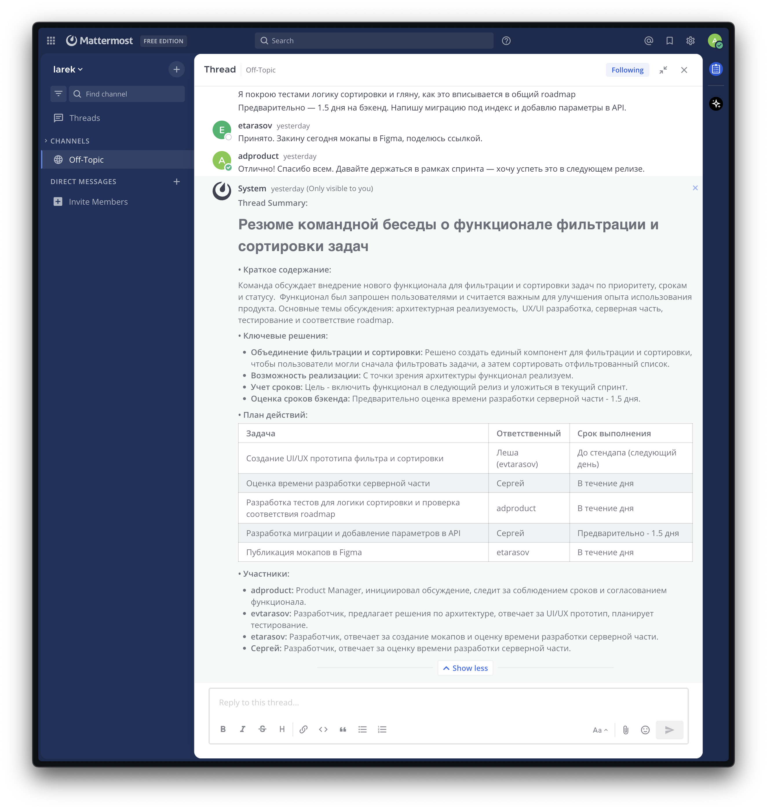

# Mattermost LLM Summary Plugin

[](https://github.com/EgorTarasov/summary/actions/workflows/ci.yml)
[](https://github.com/EgorTarasov/summary/actions/workflows/e2e.yml)

Плагин для Mattermost, который позволяет автоматически создавать краткое содержание (суммаризацию) сообщений в тредах и каналах с использованием технологий LLM (Large Language Models).

## Возможности

- 📝 **Суммаризация тредов** - получение краткого содержания всех сообщений в треде
- 📊 **Суммаризация каналов** - анализ последних сообщений в канале
- 👥 **Анализ участников** - отображение статистики участников дискуссии
- 🚀 **Простое использование** - работа через slash-команды
- 🔒 **Приватность** - результаты видны только пользователю, выполнившему команду

## Использование

### Команда `/summary`

Плагин предоставляет slash-команду `/summary` с двумя режимами работы:

#### 1. Суммаризация треда
```
/summary thread
```
или просто
```
/summary
```

Создает краткое содержание всех сообщений в текущем треде. Команду нужно выполнять, находясь в треде (в ответе на сообщение).

**Пример использования:**
1. Откройте любой тред (нажмите "Reply" на сообщение)
2. Введите `/summary` в поле ввода
3. Получите краткое содержание всех сообщений треда

#### 2. Суммаризация канала
```
/summary channel
```

Анализирует последние 50 сообщений в текущем канале и создает их краткое содержание.

**Пример использования:**
1. Находясь в любом канале, введите `/summary channel`
2. Получите анализ недавней активности в канале

### Что включает в себя суммаризация

Результат суммаризации содержит:
- **Список всех сообщений** с указанием автора
- **Статистику участников** с количеством сообщений от каждого
- **Общее количество** проанализированных сообщений
- **Автоматическое сокращение** при превышении лимита символов

### Пример результата



```
Thread Summary:

Анализ и обобщение командной беседы о фильтрации и сортировки задач
• Краткое содержание:

Команда обсуждает реализацию нового функционала: фильтрация и сортировка задач по приоритету, срокам и статусу.  Функционал является часто запрашиваемым пользователями и рассматривается как приоритетная задача. Обсуждаются архитектурные аспекты, UI/UX, серверная часть и тестовое покрытие.  Основное направление - интеграция в текущий спринт для включения в следующий релиз.

• Ключевые решения:

Функциональность: Реализация фильтрации и сортировки задач по приоритету, срокам и статусу.
Архитектура: Решение объединить компоненты фильтрации и сортировки в один, учитывая пользовательский сценарий фильтрации, а затем сортировки.
Интеграция: Функциональность должна быть реализована в рамках текущего спринта и включена в следующий релиз.
Оценка: Оценка времени на реализацию бэкенд-части – 1.5 дня (с включением написания миграции под индекс и добавления параметров в API).
• План действий:

Леша: Создание UI/UX прототипа фильтра и сортировки к завтрашнему стендапу.
Сергей: Оценка и реализация серверной части (1.5 дня), включая миграцию под индекс и добавление параметров в API.
Инициатор (имя неизвестно из переписки): Покрытие тестами логики сортировки и проверка соответствия roadmap. Покрытие тестами логики сортировки и проверка соответствия roadmap. Загрузка мокапов в Figma и предоставление ссылки.
Все: Придерживаться сроков и объема работы, выделенных на спринт.
• Участники:

Леша: Разработчик, отвечающий за UI/UX прототип.
Сергей: Разработчик, отвечающий за серверную часть.
Инициатор (имя неизвестно): Инициатор обсуждения, координирующий работу, планирующий тестирование и дорожную карту. Отвечает за координацию.
Остальные (коллеги): Активное участие в обсуждении и поддержка плана действий.
```

### Демо
Для получения доступа к демо стенду Mattermost с установленным плагином, пожалуйста, свяжитесь с разработчиком.

## Конфигурация плагина

### Доступные LLM провайдеры

Плагин поддерживает два основных провайдера для генерации суммаризации:

#### **1. Ollama (Локальный)**
Для использования локальных языковых моделей через Ollama:
- **Ollama Server URL** - URL вашего Ollama сервера (по умолчанию: `http://localhost:11434`)
- **Ollama Model** - Название модели (по умолчанию: `llama2`)

**Популярные модели Ollama:**
- `llama2` - Базовая модель LLaMA 2
- `mistral` - Mistral 7B модель
- `codellama` - Специализированная модель для кода
- `neural-chat` - Оптимизированная для диалогов

#### **2. OpenAI**
Для использования облачных моделей OpenAI:
- **OpenAI API Key** - Ваш API ключ OpenAI (обязательно)
- **OpenAI Model** - Модель для использования (по умолчанию: `gpt-3.5-turbo`)
- **OpenAI Base URL** - Базовый URL API (по умолчанию: `https://api.openai.com/v1`)

**Доступные модели OpenAI:**
- `gpt-3.5-turbo` - Быстрая и экономичная модель
- `gpt-4` - Более мощная, но дорогая модель
- `gpt-4-turbo` - Улучшенная версия GPT-4

### Настройки суммаризации

#### **Основные параметры:**
- **Max Tokens** - Максимальное количество токенов для суммаризации (по умолчанию: 1000)
- **Temperature** - Температура LLM от 0.0 до 1.0 (по умолчанию: 0.3)
  - 0.0 = Более детерминированный результат
  - 1.0 = Более креативный результат
- **Summary Language** - Язык суммаризации (auto, en, ru, es, fr, de)
- **Max Messages** - Максимальное количество сообщений за запрос (по умолчанию: 50)

#### **Дополнительные настройки:**
- **Request Timeout** - Таймаут запроса в секундах (по умолчанию: 30)
- **System Prompt** - Кастомный системный промпт для LLM
- **Enable Channel Summary** - Разрешить суммаризацию каналов (по умолчанию: включено)
- **Enable Thread Summary** - Разрешить суммаризацию тредов (по умолчанию: включено)
- **Enable Caching** - Включить кеширование результатов (по умолчанию: выключено)

### Как настроить плагин

1. **Перейдите в System Console → Plugins → LLM Summary Plugin**

2. **Выберите LLM Provider:**
   - `Ollama (Local)` - для локальных моделей
   - `OpenAI` - для облачных моделей OpenAI

3. **Настройте параметры провайдера:**

   **Для Ollama:**
   ```
   Ollama Server URL: http://localhost:11434
   Ollama Model: llama2
   ```

   **Для OpenAI:**
   ```
   OpenAI API Key: sk-ваш-ключ-здесь
   OpenAI Model: gpt-3.5-turbo
   OpenAI Base URL: https://api.openai.com/v1
   ```

4. **Настройте параметры суммаризации по необходимости**

5. **Сохраните конфигурацию**

### Примеры конфигурации

#### **Конфигурация для локального Ollama:**
```json
{
  "llm_provider": "ollama",
  "ollama_url": "http://localhost:11434",
  "ollama_model": "mistral",
  "max_tokens": 500,
  "temperature": 0.2,
  "summary_language": "ru"
}
```

#### **Конфигурация для OpenAI:**
```json
{
  "llm_provider": "openai", 
  "openai_api_key": "sk-...",
  "openai_model": "gpt-4",
  "max_tokens": 1000,
  "temperature": 0.3,
  "summary_language": "auto"
}
```

### Требования для провайдеров

#### **Ollama:**
- Установленный и запущенный Ollama сервер
- Загруженная модель (например: `ollama pull llama2`)
- Доступность сервера по указанному URL

#### **OpenAI:**
- Действующий API ключ OpenAI
- Положительный баланс на аккаунте
- Доступ к интернету для API запросов

## Установка

### Требования
- Mattermost Server версии 6.2.1 или выше
- Go 1.19 или выше для сборки из исходников

### Сборка плагина

1. Клонируйте репозиторий:
```bash
git clone https://github.com/EgorTarasov/summary.git
cd summary
```

2. Соберите плагин:
```bash
make dist
```

3. Это создаст файл плагина:
```
dist/com.mattermost.plugin-llm-summary.tar.gz
```

### Установка в Mattermost

1. **Включите загрузку плагинов** в конфигурации Mattermost (`config.json`):
```json
"PluginSettings" : {
    "Enable": true,
    "EnableUploads": true
}
```

2. **Загрузите плагин:**
   - Перейдите в System Console → Plugins → Plugin Management
   - Нажмите "Upload Plugin"
   - Выберите файл `com.mattermost.plugin-llm-summary.tar.gz`
   - Нажмите "Upload"

3. **Активируйте плагин:**
   - Найдите "Larek Tech Test Plugin" в списке
   - Нажмите "Enable"

## Разработка

### Быстрая разработка с автодеплоем

Если ваш Mattermost сервер запущен локально, вы можете использовать автоматический деплой:

```bash
export MM_SERVICESETTINGS_SITEURL=http://localhost:8065
export MM_ADMIN_TOKEN=your-admin-token
make deploy
```

### Разработка новых функций

Плагин имеет модульную архитектуру и состоит только из серверной части. Основные компоненты:

**Ключевые файлы для разработки:**
- `server/internal/commands/summary/handler.go` - основная логика команды `/summary`
- `server/plugin.go` - инициализация и регистрация компонентов плагина
- `server/api.go` - HTTP API endpoints для внешнего доступа
- `server/configuration.go` - управление конфигурацией плагина

**Архитектурные принципы:**
- **Clean Architecture** - разделение на слои (handlers, domain, store)
- **Dependency Injection** - использование интерфейсов для тестируемости
- **Single Responsibility** - каждый компонент отвечает за одну задачу

**Добавление новых команд:**
1. Создайте новый пакет в `server/internal/commands/`
2. Реализуйте интерфейс `Command` с методом `Handle()`
3. Зарегистрируйте команду в `plugin.go` в методе `OnActivate()`

### Структура проекта

```
├── server/                           # Серверная часть плагина
│   ├── internal/                     # Внутренняя логика плагина
│   │   ├── commands/                 # Обработчики команд
│   │   │   ├── mocks/                # Моки для тестирования
│   │   │   └── summary/              # Команда суммаризации
│   │   │       ├── handler.go        # Основная логика команды /summary
│   │   │       └── handler_test.go   # Тесты для обработчика
│   │   └── domain/                   # Доменная логика
│   │       └── summary/              # Модели и сервисы суммаризации
│   ├── store/                        # Слой доступа к данным
│   │   └── kvstore/                  # Key-Value хранилище
│   ├── api.go                        # HTTP API endpoints
│   ├── configuration.go             # Конфигурация плагина
│   ├── job.go                        # Фоновые задачи
│   ├── main.go                       # Точка входа плагина
│   ├── manifest.go                   # Работа с манифестом
│   ├── plugin.go                     # Основная логика плагина
│   └── plugin_test.go               # Тесты плагина
├── webapp/                          # Frontend компоненты (минимальный)
│   ├── src/
│   │   ├── components/              # React компоненты
│   │   ├── types/                   # TypeScript типы
│   │   └── index.tsx               # Точка входа webapp
│   ├── package.json                # JavaScript зависимости
│   └── webpack.config.js           # Конфигурация сборки
├── assets/                         # Статические ресурсы
│   └── starter-template-icon.svg   # Иконка плагина
├── build/                          # Скрипты и утилиты сборки
├── dist/                          # Скомпилированный плагин
├── .github/                       # GitHub Actions CI/CD
├── plugin.json                    # Манифест плагина
├── go.mod                        # Go модули
├── go.sum                        # Контрольные суммы зависимостей
└── Makefile                      # Скрипты сборки и деплоя
```

## Технические детали

### Архитектура

Плагин реализован как server-only плагин для Mattermost, который:
- Регистрирует slash-команду `/summary` при активации
- Использует Mattermost Plugin API для получения сообщений
- Обрабатывает данные и возвращает результат через ephemeral сообщения

### API Endpoints

Плагин также предоставляет HTTP API endpoint:
- `POST /plugins/com.mattermost.plugin-llm-summary/api/v1/summary` - для программного доступа к функциям суммаризации

### Будущие возможности

- 🤖 Интеграция с реальными LLM сервисами (OpenAI, Claude, локальные модели)
- 📈 Более продвинутая аналитика контента
- 🎯 Настраиваемые фильтры сообщений
- 💾 Кеширование результатов
- 🌍 Поддержка множественных языков

## Roadmap развития

### 🎯 Этап 1: Базовая функциональность и тестирование API
**Цель:** Проверить работоспособность плагина и корректность интеграции с Mattermost API

**Задачи:**
- ✅ Реализация базового плагина с slash-командой `/summary`
- ✅ Настройка системы конфигурации с поддержкой LLM провайдеров
- ✅ Создание структуры проекта и системы сборки
- ✅ Тестирование взаимодействия с Mattermost Plugin API
- ✅ Валидация получения сообщений из тредов и каналов
- ✅ Проверка корректности отправки ephemeral ответов

**Критерии завершения:**
- Плагин успешно регистрируется и активируется в Mattermost
- Команда `/summary` корректно получает и обрабатывает сообщения
- Система конфигурации работает через System Console

---

### 📊 Документация архитектуры
**Цель:** Зафиксировать схему работы плагина для презентации и дальнейшего развития

**Задачи:**
- ✅ Создание PlantUML диаграммы архитектуры плагина
- ✅ Диаграмма последовательности обработки команд
- ✅ Схема взаимодействия с LLM провайдерами
- ✅ Диаграмма потоков данных (от получения сообщений до ответа пользователю)

**Результаты:**
- `docs/architecture.puml` - основная архитектурная диаграмма
- `docs/sequence.puml` - диаграмма последовательности команд
- `docs/data-flow.puml` - схема потоков данных
- Возможность быстро презентовать концепцию плагина

---

### 🤖 Этап 2: LLM интеграция и провайдеры
**Цель:** Определить контракт для LLM провайдеров и реализовать Ollama provider

**Задачи:**
- ✅ Проектирование интерфейса `LLMProvider` с методами:
  - `GenerateSummary(messages []Message, config Config) (Summary, error)`
  - `ValidateConfiguration() error`
  - `GetSupportedModels() []string`
- ✅ Реализация Ollama HTTP клиента с поддержкой:
  - Отправки запросов к Ollama API (`/api/generate`)
  - Обработки streaming и non-streaming ответов
  - Настройки температуры, max_tokens и других параметров
- 🔄 Создание фабрики провайдеров для выбора между Ollama/OpenAI
- ✅ Интеграция провайдера в команду `/summary`
- 🔄 Обработка ошибок и таймаутов LLM запросов
- ✅ Добавление unit и интеграционных тестов к обработчикам

**Критерии завершения:**
- Команда `/summary` генерирует реальные суммаризации через Ollama
- Корректная обработка различных типов ошибок (сеть, модель, API)
- Настройка провайдера через конфигурацию плагина

---

### 📝 Этап 3: Форматирование и сохранение результатов
**Цель:** Структурированный вывод суммаризации и персистентность данных

**Задачи:**
- 🔄 Создание структурированного формата ответа:
  - Краткое содержание (summary)
  - Ключевые моменты (key points)
  - Статистика участников (participant stats)
  - Временные метки и метаданные
- 🔄 Форматирование Markdown ответов для Mattermost
- 🔄 Реализация хранения результатов в KV Store:
  - Модель `SummaryResult` с полями (thread_id, channel_id, summary, timestamp)
  - CRUD операции для работы с сохраненными суммаризациями
  - Индексация по thread_id и channel_id
- 🔄 История суммаризации для пользователей
- 🔄 Ограничения на размер сохраняемых данных

**Критерии завершения:**
- Суммаризация выводится в читабельном структурированном формате
- Результаты корректно сохраняются и извлекаются из KV Store
- Пользователи могут просматривать историю своих запросов

---

### ⚡ Этап 4: Кэширование и оптимизация
**Цель:** Избежать повторных запросов к LLM для одинакового контента

**Задачи:**
- 🔄 Создание системы кэширования на основе:
  - Хеш-ключей содержимого сообщений (MD5/SHA256)
  - Thread ID + количество сообщений + последний timestamp
  - Channel ID + диапазон сообщений для суммаризации
- 🔄 Реализация `CacheService` с методами:
  - `GetCachedSummary(key string) (*Summary, bool)`
  - `StoreSummary(key string, summary *Summary, ttl time.Duration)`
  - `InvalidateCache(pattern string)`
- 🔄 Настройка TTL (Time To Live) для кэш записей
- 🔄 Логика определения актуальности кэша:
  - При добавлении новых сообщений в тред
  - При изменении конфигурации LLM провайдера
  - По истечении времени жизни кэша
- 🔄 Административные команды для управления кэшем
- 🔄 Метрики использования кэша (hit/miss ratio)

**Критерии завершения:**
- Повторные запросы суммаризации возвращаются мгновенно из кэша
- Кэш автоматически инвалидируется при изменении контента
- Настройка кэширования доступна в конфигурации плагина
- Логи отображают статистику использования кэша

---

### 🚀 Будущие этапы (после MVP)
- **Этап 5:** Поддержка OpenAI и других LLM провайдеров
- **Этап 6:** Расширенная аналитика и insights
- **Этап 7:** Интеграция с внешними системами (Jira, GitHub)
- **Этап 8:** Мобильная оптимизация и Progressive Web App

## Устранение проблем

### Проблемы с конфигурацией

#### **Ошибки Ollama:**
- **"Ollama URL must be specified"** - Убедитесь, что URL Ollama указан корректно
- **"Ollama model must be specified"** - Проверьте, что модель указана и загружена
- **Соединение отклонено** - Убедитесь, что Ollama сервер запущен:
  ```bash
  ollama serve
  ```
- **Модель не найдена** - Загрузите модель:
  ```bash
  ollama pull llama2
  ```

#### **Ошибки OpenAI:**
- **"OpenAI API key must be specified"** - Добавьте действующий API ключ
- **"Authentication failed"** - Проверьте корректность API ключа
- **"Rate limit exceeded"** - Превышен лимит запросов, подождите или обновите план
- **"Insufficient quota"** - Пополните баланс аккаунта OpenAI

#### **Общие ошибки конфигурации:**
- **"max_tokens must be greater than 0"** - Установите положительное значение для max_tokens
- **"temperature must be between 0.0 and 1.0"** - Проверьте диапазон temperature
- **"unsupported LLM provider"** - Выберите 'ollama' или 'openai'

### Команда не отвечает
- Убедитесь, что плагин активирован в System Console
- Проверьте логи Mattermost на наличие ошибок
- Убедитесь, что у пользователя есть права на использование slash-команд
- Проверьте, что конфигурация LLM провайдера валидна

### Не работает суммаризация треда
- Команду `/summary thread` нужно выполнять находясь в треде
- Проверьте, что в треде есть сообщения для анализа
- Убедитесь, что `enable_thread_summary` установлено в `true`

### Проблемы с установкой
- Убедитесь, что в конфигурации включены плагины и их загрузка
- Перезапустите сервер Mattermost после изменения конфигурации

## Лицензия

Этот проект распространяется под лицензией MIT.

## Поддержка

Если у вас возникли проблемы или есть предложения по улучшению:
- Создайте [GitHub Issue](https://github.com/EgorTarasov/summary/issues)
- Отправьте Pull Request с улучшениями
