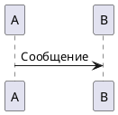
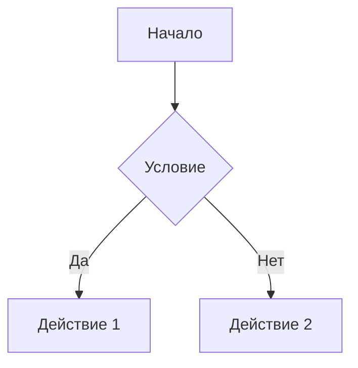

# Создание и развертывание документации MkDocs

## Быстрый старт

### 1. Установка зависимостей

```bash
# Создайте виртуальное окружение Python
python -m venv venv-docs
source venv-docs/bin/activate  # На Windows: venv-docs\Scripts\activate

# Установите зависимости
pip install -r requirements-docs.txt
```

### 2. Запуск локального сервера

```bash
# Запуск сервера разработки
mkdocs serve

# Документация будет доступна по адресу http://127.0.0.1:8000
```

### 3. Сборка статического сайта

```bash
# Сборка документации
mkdocs build

# Результат в папке dist/
```


## Развертывание на GitHub Pages

### 1. Настройка GitHub Actions

Создайте файл `.github/workflows/docs.yml`:

```yaml
name: Deploy Documentation
on:
  push:
    branches: [ master ]
  pull_request:
    branches: [ master ]

permissions:
  contents: read
  pages: write
  id-token: write

jobs:
  docs:
    runs-on: ubuntu-latest
    steps:
    - uses: actions/checkout@v4
    
    - name: Configure Git Credentials
      run: |
        git config user.name github-actions[bot]
        git config user.email 41898282+github-actions[bot]@users.noreply.github.com
    
    - uses: actions/setup-python@v4
      with:
        python-version: 3.x
        
    - run: echo "cache_id=$(date --utc '+%V')" >> $GITHUB_ENV 
    
    - uses: actions/cache@v3
      with:
        key: mkdocs-material-${{ env.cache_id }}
        path: .cache
        restore-keys: |
          mkdocs-material-
          
    - run: pip install -r requirements-docs.txt
    
    - run: mkdocs gh-deploy --force
```

### 2. Включение GitHub Pages

1. Перейдите в Settings → Pages вашего репозитория
2. Выберите Source: "Deploy from a branch"  
3. Выберите Branch: "gh-pages"
4. Нажмите Save

## Редактирование документации

### Добавление новых страниц

1. Создайте файл `.md` в соответствующей папке
2. Добавьте страницу в навигацию в `mkdocs.yml`:

```yaml
nav:
  - Новый раздел:
    - Новая страница: path/to/new-page.md
```

### Использование PlantUML диаграмм

PlantUML диаграммы встраиваются автоматически:

~~~markdown

~~~

### Использование Mermaid диаграмм

~~~markdown

~~~

## Локализация

Документация настроена для работы с русским языком:

- Поиск поддерживает русскую морфологию
- Интерфейс переведен на русский
- Настроены правильные шрифты для кириллицы

## Полезные команды

```bash
# Проверка корректности конфигурации
mkdocs config

# Сборка с подробным выводом
mkdocs build --verbose

# Очистка кэша и пересборка  
mkdocs build --clean

# Проверка всех ссылок
mkdocs build --strict
```

## Конфигурация темы Material

Тема настроена с поддержкой:
- ✅ Темная/светлая тема с переключателем
- ✅ Навигация с вкладками и секциями  
- ✅ Поиск с подсветкой результатов
- ✅ Копирование кода одним кликом
- ✅ Интеграция с GitHub
- ✅ Адаптивный дизайн для мобильных устройств
