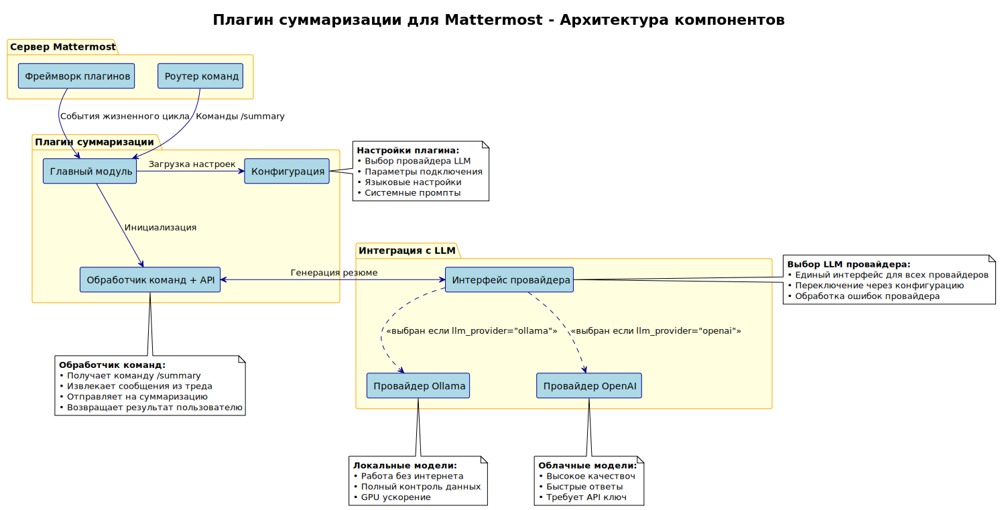

# Архитектура компонентов

Архитектура плагина суммаризации для Mattermost построена по принципу модульности и расширяемости.

## Диаграмма компонентов

## Описание компонентов

### Сервер Mattermost

**Фреймворк плагинов** - базовая инфраструктура Mattermost для работы с плагинами. Обеспечивает:
- Жизненный цикл плагина (активация, деактивация)
- API для взаимодействия с Mattermost
- Система событий и хуков

**Роутер команд** - компонент Mattermost, обрабатывающий slash-команды. Направляет команды `/summary` в плагин.

### Плагин суммаризации

**Главный модуль** - точка входа в плагин. Отвечает за:
- Инициализацию компонентов
- Регистрацию команд
- Обработку событий жизненного цикла

**Конфигурация** - управление настройками плагина:
- Выбор провайдера LLM
- Параметры подключения к внешним сервисам  
- Языковые настройки и промпты
- Лимиты и таймауты

**Обработчик команд** - основная бизнес-логика:
- Получение команды `/summary`
- Извлечение сообщений из треда
- Отправка на суммаризацию
- Возврат результата пользователю

### Интеграция с LLM

**Интерфейс провайдера** - абстракция для работы с различными LLM:
- Единый интерфейс для всех провайдеров
- Переключение через конфигурацию
- Обработка ошибок провайдера

**Провайдер Ollama** - реализация для локальных моделей:
- Работа без интернета
- Полный контроль данных
- GPU ускорение

**Провайдер OpenAI** - реализация для облачных моделей:
- Высокое качество генерации
- Быстрые ответы
- Требует API ключ

### Внешние сервисы

**Сервер Ollama** - локальный сервер для запуска LLM моделей
**OpenAI API** - облачный сервис для доступа к GPT моделям

## Принципы архитектуры

### Модульность
Каждый компонент имеет четко определенные границы и интерфейсы, что позволяет легко заменять и тестировать отдельные части системы.

### Расширяемость
Архитектура позволяет легко добавлять новых провайдеров LLM через реализацию общего интерфейса.

### Конфигурируемость
Все ключевые параметры выносятся в конфигурацию, позволяя адаптировать плагин под различные сценарии использования.

### Отказоустойчивость
Система обрабатывает ошибки на всех уровнях и предоставляет fallback-механизмы для критических операций.
