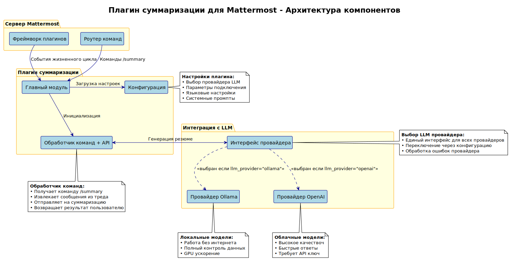

# Плагин суммаризации Mattermost

Плагин для автоматической суммаризации сообщений и тредов в Mattermost с использованием различных моделей машинного обучения (LLM).

## Возможности

- 🤖 **Поддержка нескольких LLM провайдеров**: Ollama (локальные модели) и OpenAI-совместимые API
- 🇷🇺 **Русский язык**: Оптимизированные промпты для качественной суммаризации на русском языке
- ⚡ **Простое использование**: Команда `/summary` для быстрого получения резюме треда
- 🔧 **Гибкая настройка**: Настраиваемые промпты, модели и параметры
- 🛡️ **Приватность**: Возможность использования локальных моделей без передачи данных в облако

## Быстрый старт

### Установка

1. Загрузите последний релиз плагина
2. Загрузите плагин в Mattermost через System Console
3. Настройте конфигурацию LLM провайдера

### Использование

Для получения резюме треда используйте команду:

```
/summary
```

Плагин автоматически проанализирует сообщения в текущем треде и создаст краткое резюме.

## Архитектура



Плагин состоит из нескольких ключевых компонентов:

- **Обработчик команд** - обрабатывает команды пользователей
- **Интерфейс LLM провайдера** - единый интерфейс для работы с различными моделями
- **Провайдеры** - реализации для Ollama и OpenAI
- **Конфигурация** - настройки плагина и провайдеров

## Поддерживаемые модели

### Ollama (локальные модели)
- llama3.2 (рекомендуется)
- qwen2.5
- mistral
- и другие совместимые модели

### OpenAI-совместимые API
- OpenAI GPT-4, GPT-3.5-turbo
- Локальные OpenAI серверы
- Другие совместимые API

## Лицензия

Этот проект распространяется под лицензией MIT. Подробности см. в файле [LICENSE](LICENSE).
